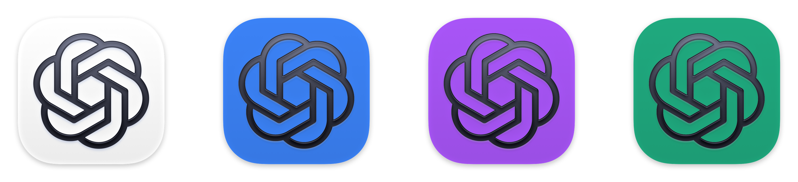
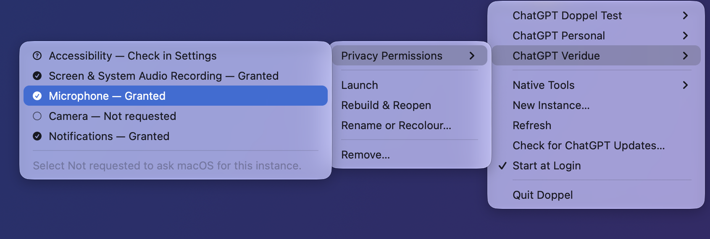

# Doppel

<p align="center">
  
</p>

Run one macOS app as several truly separate apps: separate accounts, separate data,
separate name and icon in the Dock, Finder, Spotlight and the Cmd-Tab switcher.

Doppel was built for the ChatGPT desktop app, which supports only one account per
install. It clones the app you already have into additional instances ("ChatGPT
Personal", "ChatGPT Work", each with its own tinted icon), points each instance at
its own data directories, and re-signs the clone locally. No vendor code ships
with this project; every clone is generated on your machine from your own
installed copy. When an update is available, Doppel downloads it only from the
official OpenAI appcast and verifies the vendor signature before installation.

<p align="center">
  
</p>

## Why not just a launcher script?

A wrapper that starts the same app with a different profile works, but macOS treats
the running process as the original app: same icon, same Dock identity, and only one
of them can pin to the Dock meaningfully. A Doppel instance is a real bundle with
its own bundle identifier, so macOS treats it as a genuinely different app.

## Coordinated ChatGPT updates

Managed instances cannot safely run ChatGPT's own Sparkle installer: their local
identity cannot match OpenAI's signing Team ID, and an in-place vendor update
would erase Doppel's launcher and account routing. Doppel disables that updater
inside every instance and checks OpenAI's production appcast itself.

The menu app checks shortly after launch and every six hours. Its native prompt
uses the primary ChatGPT icon and the same two-stage flow as the standard updater:
download or remind later, then restart and install or wait. The download is
resumable, its URL has to match OpenAI's own release path, and nothing closes until
the staged app has the expected bundle ID, build number and a signature satisfying
the vendor app's own designated requirement: Apple-anchored, Developer ID, and
OpenAI's Team ID. An update also has to be strictly newer than the installed build,
so an older genuine release cannot be replayed. See
[the threat model](docs/THREAT-MODEL.md) for what these checks do and do not cover.

On restart Doppel records which instances were open, closes all managed apps,
atomically replaces the untouched primary while keeping a rollback, rebuilds
every installed instance concurrently, verifies the source build plus each
instance's pinned signature, and reopens only the apps that were previously
running. APFS copy-on-write clones avoid copying the unchanged parts of the
1+ GB vendor bundle once per instance. A failed
download changes nothing; a failed install restores the previous primary; and a
partial rebuild keeps the restart manifest and reports the exact instance.

## Usage

The menu bar app covers the everyday flows; **New Instance…** asks for a name
and a colour and derives everything else:

<p align="center">
  
</p>

The CLI drives the same engine:

```sh
bin/doppel create --name "ChatGPT Personal" \
    --bundle-id com.openai.codex.personal \
    --scheme codex-personal \
    --profile-root "$HOME/Library/Application Support/ChatGPT Personal" \
    --codex-home "$HOME/.codex-personal" \
    --tint F28C28

bin/doppel list
bin/doppel launch "ChatGPT Personal"
bin/doppel browser assign "ChatGPT Personal"  # give this profile the built-in browser
bin/doppel browser status
bin/doppel browser release
bin/doppel rebuild "ChatGPT Personal"
bin/doppel native-tools status
bin/doppel native-tools repair
bin/doppel native-tools claim-browser "ChatGPT Personal"
bin/doppel native-tools claim-browser --browser Edge "ChatGPT Work"
bin/doppel update check
bin/doppel update prepare
bin/doppel update apply
bin/doppel update verify
bin/doppel edit "ChatGPT Personal" --rename "ChatGPT Home" --tint 3B82F6
bin/doppel remove "ChatGPT Personal"                # keeps the account data
bin/doppel remove "ChatGPT Personal" --purge-data    # data to the Trash too
bin/doppel prune                                     # drop old rollback copies
bin/doppel prune "ChatGPT Personal"                  # just this instance's
```

`rebuild` opens the rebuilt instance when it succeeds, even if the instance was
closed before the command began. Set `DOPPEL_RELAUNCH=0` for maintenance or QA
that should rebuild without opening the app. The menu labels this action
**Rebuild & Reopen**.

If a current OpenAI release validates only inside its notarized disk image and
the byte-identical `/Applications/ChatGPT.app` fails the older standalone
strict-signature check, Doppel can rebuild from the exact-build verified image
preserved at `updates/Official/<build>/ChatGPT.dmg`. It mounts that image
read-only for the rebuild, applies the same bundle ID, build, Team ID and strict
nested-signature checks, and unmounts it before reopening the instance.

`edit` renames an instance, changes its icon colour, or both, and reopens the
instance afterwards if it was running, so the change is visible immediately.
Identity and data stay put — the bundle identifier, URL scheme and data
directories are fixed when an instance is created — so a rename never separates
an account from its chats. Instances can be referred to by their current name at
any time; a name that would end up sharing another instance's identifier is
refused, because one of the two would then be unreachable.

`remove` never erases anything: the app bundle goes to the Trash, the instance
definition is preserved under `state/Removed/` so the removal can be undone, and
account data (profile and `CODEX_HOME`) is left in place unless `--purge-data` is
given — and even then it is moved to the Trash, not deleted.

`--purge-data` also refuses to touch anything that is not clearly the
instance's own: a home directory or one of its standard folders, a path outside
the home directory, data another instance is using, and the directories the
primary app and the Codex CLI use by default. An instance can legitimately be
pointed at those to adopt an existing account, which is exactly why removing it
must not take them with it. The refusal happens before anything is moved, so a
refused purge leaves the instance intact; remove it without the flag and delete
what you actually want gone yourself.

Every rebuild keeps the previous bundle as a rollback, and a vendor update
rebuilds on its own, so `prune` exists to drop the ones you no longer need. It
keeps the most recent rollback per instance (`DOPPEL_KEEP_BACKUPS` to change
that) and clears any staging left by a build that died. Rebuilds prune as they
go, so this is only needed to reclaim what earlier versions left behind.

Stored rollbacks are deliberately kept out of normal macOS app discovery. For
locally signed instances, Doppel moves the signed `Contents/Info.plist` aside
without editing it; restoration moves the exact file back before verification.
The untouched vendor-primary rollback stays whole under a hidden `.Backups`
directory because macOS App Management can prohibit changes inside vendor code.
`native-tools repair` applies those reversible migrations to rollbacks created
by older Doppel versions; it does not change active apps or account data.

`create` clones the primary app, tints its real icon with the colour you chose,
installs the instance into `~/Applications`, and stores the instance definition in
`~/Library/Application Support/Doppel/instances/`.

### Assigning the built-in browser

Doppel treats an account profile and the process that opens it as separate
things. By default a profile uses its own locally signed Doppel app. One profile
at a time can instead use the untouched `/Applications/ChatGPT.app` as its
engine, preserving the OpenAI signature chain required by the built-in browser:

```sh
bin/doppel browser assign "ChatGPT Personal"
bin/doppel launch "ChatGPT Personal"
```

Assignment never closes an app. If the profile's clone or another official
ChatGPT engine is already running, launch fails with an instruction to close the
conflicting window first; Doppel never risks two Electron processes opening the
same profile. Opening the assigned profile's branded app directly from Finder or
the Dock routes through that same official-engine launch path; it cannot silently
fall back to the locally signed engine. Assignment refuses an older or modified
clone until it has been rebuilt with the current signed router. Direct fallback
launches use the same lock and a private one-shot authorization, so assignment
cannot cross the moment a clone adopts its Electron profile. `CODEX_HOME`, browser
data and account state still come from the
selected Doppel profile. The Dock/window identity is ordinary ChatGPT while that
engine is active because changing the vendor bundle would invalidate its
signature. `browser release` returns the profile to its normal Doppel engine and
also refuses while the official engine is running. Engine changes, launches,
rebuilds, removals and update installation share one lock, so two concurrent
Doppel commands cannot cross those checks. If the coordinator is interrupted,
it keeps that lock until the isolated critical worker has finished, so a launch
or filesystem operation cannot continue after another command enters. The lock
lease covers the worker's process group, so a supervisor crash cannot make an
active operation look stale. The
official engine is started from a clean environment containing only ordinary
macOS account values, the SSH agent socket when present, and its intended profile
inputs. Inherited Codex sandbox/thread variables are never forwarded. Its own
Sparkle updater is disabled for this session; Doppel updates every engine together,
and release first verifies that the fallback clone is on the matching build.
Doppel records the official process PID, start identity and build after launch;
it will not silently adopt a manually opened process whose `CODEX_HOME` it
cannot prove.

### Permissions for managed apps

macOS grants privacy permissions to each app identity separately. A new Doppel
instance therefore does not inherit access from ChatGPT or from another managed
instance. Each instance's **Privacy Permissions** submenu shows the status of
**Microphone**, **Camera**, **Accessibility**, **Screen & System Audio
Recording**, and **Notifications**. Clicking a row opens that exact System
Settings category when access was denied or is already granted. If the app has
not asked yet, clicking the row first runs Apple's native request as that one
managed instance. That request is what registers an otherwise absent app in
the Microphone, Camera, Screen Recording, or Accessibility list. Doppel then
refreshes the status; it never requests unrelated permissions at the same time.
When a profile is assigned Built-in Browser, this submenu is labelled
**Fallback Doppel Permissions**: official ChatGPT has its own macOS permission
identity and these grants apply only after the profile returns to its clone.

Camera and microphone are optional until that account uses the relevant feature,
so `Not requested` is informational and never raises a warning. The public
Accessibility and Screen Recording checks expose only a boolean and can lag or
disagree with the visible System Settings row; Doppel labels an inconclusive
result `Check in Settings` instead of claiming the permission is missing. Only an explicit
denial, restriction, or outdated checker changes the menu-bar icon to a warning.

Permissions that macOS grants only in the context of a specific action or
target—such as Files and Folders, Calendar, Reminders, Location, and Apple
Events—continue to be requested by ChatGPT when that feature is used. Doppel
does not manufacture broad requests for capabilities an account may never use.
Doppel never resets or writes the macOS privacy database itself; permissions
remain under your control in System Settings. The menu app checks through Launch
Services so macOS attributes the probe to the managed bundle rather than to
Doppel itself, and checks again every five minutes and after a rebuild. Managed
apps no longer raise a broad permission assistant at launch. Optional access is
requested either by ChatGPT when a feature needs it or by selecting that one row
in Doppel.

### Native tools

The menu's **Native Tools** section reports whether the shared Computer Use
service is ready, which running app currently owns Chronicle's shared recorder,
the age of its latest screen frame, and whether an old rollback is still being
discovered as a duplicate app.

`doppel native-tools status` additionally reports the profile assigned the
official built-in-browser engine and which app owns each ChatGPT
browser-extension registration. A locally signed engine still uses the extension
as its route to a real browser; the assigned profile is launched through the
untouched OpenAI-signed app instead. The extension arrives through one
native-messaging registration per Chromium browser. Every ChatGPT app rewrites
that registration to its own extension host while starting, so the owner is
whichever app launched last.

Sharing one browser between instances does **not** require owning the
registration. It only decides whose extension host Chrome launches; once that
host is running, its socket is listed in a machine-wide registry that every
managed instance can read, so several instances can drive the same Chrome at the
same time. They share its tabs, and the browser API's tab claiming is what keeps
two agents off the same one. That coordination is the vendor's, not Doppel's:
ChatGPT builds the environment its browser client runs in from scratch, so none
of Doppel's variables reach it and there is no window or profile preference for
Doppel to pin. Giving two instances different browsers is the only separation
Doppel can actually enforce.

Ownership still matters when it is wrong: if it points at a runtime whose host
binary is missing, Chrome launches nothing and no instance gets a browser, and if
it points at a stale runtime, every instance uses that older host.
`native-tools claim-browser <name>` moves it, changing only the path inside the
vendor's existing registration and leaving its host name and allowed origins
untouched. Reconnect the extension afterwards. Each browser is separate, so
`--browser <name>` moves one without disturbing the rest; the menu lists every
registration with its current owner and assigns them the same way. A claim holds
until another managed app launches and takes it back, which `status` will show. `doppel native-tools status --porcelain` exposes
the same evidence plus each managed instance's exact installed path and bundle
identifier for diagnostics. Computer Use can run while several managed instances
are open; agents should use those exact active paths when a display name is not
unique.

### Dependencies

The installed app is self-contained. Sparkle 2 ships inside `Doppel.app`, while
icon tinting, the instance launcher and the error helper are compiled binaries
in the same bundle. Everything else Doppel calls — `codesign`, `security`,
`sips`, `iconutil`, `lsregister` — is part of macOS. Building from a checkout
needs Swift Package Manager for the pinned Sparkle dependency and the Xcode
Command Line Tools.

### Menu-bar app

```sh
app/build-app.zsh          # builds and installs ~/Applications/Doppel.app
app/build-app.zsh /tmp/out # or somewhere else, to leave your installed copy alone
open -a ~/Applications/Doppel.app
app/test.zsh               # unit tests for the menu app's parsing
```

Local builds are signed ad hoc. Set `DOPPEL_SIGN_ID` to a **Developer ID
Application** identity and `DOPPEL_SPARKLE_PUBLIC_KEY` to the release EdDSA
public key to produce a distributable build. Sparkle and Doppel's helpers are
signed inside-out before the outer bundle, with hardened runtime and a secure
timestamp.

`app/test.zsh` rather than a bare `swift test`: XCTest ships inside Xcode, not
with the Command Line Tools, and a Mac can have Xcode installed while
`xcode-select` still points at the Command Line Tools. The script finds a
toolchain that has XCTest instead of asking you to change that global setting.
The `qa/` suites need nothing beyond macOS.

A menu-bar-only front end (`LSUIElement`, so no Dock icon): list instances,
launch, rebuild, rename, recolour or remove them, coordinate ChatGPT updates,
create a new one from a name plus a colour picker, toggle **Start at Login**, or
choose **Check for Doppel Updates…**.
The foot of the menu shows Doppel's own version and the ChatGPT build it is
managing, which is what you want to hand over when reporting a problem.

The app is self-contained. The CLI, the engine and the compiled helpers all ship
inside `Contents/Resources/doppel`, sealed by the app's own signature, so a
downloaded copy works on its own — no checkout, no package manager, no developer
tools. Every action still goes through that bundled CLI, so the two can never
disagree. A checkout at a standard location is used when the app is run from
source, skipping any path that is group- or world-writable. `$DOPPEL_CLI` can
point somewhere else, but only with `DOPPEL_DEV=1` set and only at a binary that
is not group- or world-writable: an installed copy otherwise follows the CLI it
shipped with, the same way the CLI and engine ignore their own overrides. An
advisory lock stops launchd and Finder producing two menu-bar icons.

Start at Login installs a user LaunchAgent (`ai.doppel.menubar`) rather than using
SMAppService, which needs a Developer ID-signed bundle that local ad-hoc builds
don't have. Turning the toggle off boots the job out and removes the plist.

### Doppel updates and releases

Sparkle checks the signed `appcast.xml` on GitHub and verifies every update with
the EdDSA public key sealed into the installed app. Automatic checks are enabled;
the menu item provides an immediate manual check. Doppel's own updater is
separate from the coordinated ChatGPT update flow described above.
Ad-hoc builds without a public key keep both automatic and manual update checks
disabled rather than accepting an unsigned feed.

The existing v1.0.0 asset does not contain Sparkle, so the first Sparkle-enabled
release must be installed manually once. For a personal ad-hoc release, macOS
will block that first downloaded build until you approve it with **Open Anyway**
in Privacy & Security. Later releases are verified with the Sparkle EdDSA key and
can install themselves. This is suitable for personal use, but it is not the
normal trusted installation experience for public users.

Release packaging is an explicit two-step publication flow:

```sh
just sparkle-key             # once; keeps the private key in your Keychain
${EDITOR:-open} release-notes/1.1.0.md
just package-release 1.1.0 12
```

Back up that private key once to encrypted storage; do not commit the export:

```sh
app/.build/artifacts/sparkle/Sparkle/bin/generate_keys \
  --account ai.doppel.menubar -x /secure/backup/doppel-ed25519.key
```

The default recipe requires non-empty Markdown notes at
`release-notes/<version>.md`, builds a universal app, ad-hoc signs nested code
inside-out, creates the release ZIP, and generates `dist/releases/appcast.xml`
with the key stored under the `ai.doppel.menubar` Keychain account. Sparkle
embeds the notes in the signed appcast so its update window always has a What's
New section. The recipe does not upload or change git. Review the ZIP, notes and
feed, use the Markdown as the GitHub release notes, upload the ZIP, then replace
the repository `appcast.xml` with the generated feed.
Keep the EdDSA private key safe; losing it means existing ad-hoc installs cannot
trust a replacement update key.

Developer ID distribution can be added later without changing the normal
release command:

```sh
export DOPPEL_SIGN_ID="Developer ID Application: Example (TEAMID)"
export NOTARY_KEYCHAIN_PROFILE="doppel-notary"
just package-release 1.2.0 13
```

With those variables set, the recipe also submits the app to Apple, staples and
validates the notarisation ticket, and assesses the result with Gatekeeper.

## Secure signing

Doppel can create its own local code-signing identity — in the menu bar, **Set
Up Secure Signing**, or from the CLI:

```sh
bin/doppel-signing status
bin/doppel-signing setup     # creates the identity, no Keychain Access needed
bin/doppel-signing remove
```

The menu-bar route also rebuilds every instance afterwards, which is the step
that actually makes them adopt the identity.

### Why it matters

Clones are signed ad hoc by default, which has two consequences.

The visible one: macOS keychain grants ("Always Allow") are bound to the
signature, and an ad-hoc signature changes on every rebuild, so the keychain
consent dialog comes back after every vendor update.

The security one: an ad-hoc signature pins nothing. Any process running as your
user can modify a clone and re-sign it (`codesign -f -s -`), and the result still
passes verification — the instance launcher's signature check cannot tell the
difference. With a stable identity the launcher pins the certificate leaf, and an
attacker's ad-hoc re-seal no longer satisfies it (verified: an ad-hoc bundle fails
any `certificate leaf` requirement).

The requirement the launcher checks is kept outside the bundle, under
`Doppel/pins/`, keyed by the bundle's install path. That matters more than it
sounds: the launcher used to read the requirement out of the same `Info.plist`
it was about to validate, so deleting one key and re-sealing ad hoc dropped it
to a much weaker identifier-only check that the re-seal then satisfied. The
install path is chosen by whoever launches the app, and a tampered bundle
cannot restate it. Read the limits of this below — it is not a boundary against
something already running as you, only one more thing that has to be got right.

`doppel-signing setup` generates a code-signing certificate with OpenSSL and
imports it into your login keychain, granting `codesign` access to the key so
signing stays silent. No administrator rights and no trust prompt: the
certificate is deliberately left untrusted, because `codesign` signs with it
regardless and trusting it would need an admin authorisation. That also means
`security find-identity -v` will not list it — look for the certificate itself,
which is what Doppel does.

Keep the private key in a keychain you lock; any process running as you can
otherwise ask `codesign` to sign with it.

## Honest limitations

A fuller account of what Doppel protects, what it does not, and where a clone is
genuinely weaker than the app it was copied from is in
[docs/THREAT-MODEL.md](docs/THREAT-MODEL.md). The summary below is the short form.

- The vendor's terms may not contemplate running modified copies. Doppel keeps
  everything local and personal-use; do not redistribute a built instance.
- "ChatGPT" and its icon belong to OpenAI. Instance names and icons you create are
  your local Finder labels, nothing more. This project is not affiliated with or
  endorsed by OpenAI.
- Launch-time deep-link registration uses each instance's private scheme, but
  OAuth retains OpenAI's registered `codex://connector/oauth_callback` URI.
  Each clone declares that callback scheme without claiming it during normal
  launch. The instance starting connector authorization claims `codex://` only
  for that authorization, so the result returns there instead of to the clone
  launched most recently. Doppel refuses a rebuild if a vendor release changes
  either interception point and repairs stale shared-handler ownership from old
  builds.
- **The in-app browser cannot work inside a locally re-signed clone, and this
  one is permanent.**
  ChatGPT gates its browser socket with a native peer check that requires the
  connecting process, its parent *and* its grandparent to each carry OpenAI's
  Team ID and an allow-listed signing identifier. In an instance the first two
  are the vendor's own `node_repl` and `codex`, but the grandparent is the
  instance's main executable, which had to be re-signed locally to carry its own
  bundle identifier and so has no Team ID at all. Requesting it fails with
  `Browser is not available: iab`, and the app records
  `rejected socket peer reason=missing-code-signing-identity` in
  `~/Library/Logs/com.openai.codex/`. Nothing short of OpenAI's signing key
  satisfies that check, so a local identity from `doppel-signing` does not help
  either. A normal clone therefore uses the browser extension: its check stops
  at the parent process, so browser control works normally and several instances
  can share one browser. Doppel's one movable built-in-browser slot instead
  launches the selected profile through the untouched official app. It remains
  the same Doppel account profile, but macOS shows the official ChatGPT identity
  while it runs. Doppel reports the assigned and active engine in
  `native-tools status` rather than leaving the distinction implicit.
- Instances are unsigned by Apple standards (ad hoc or self-signed), so Gatekeeper
  assessment (`spctl`) rejects them. They launch fine because they are built
  locally and never quarantined.
- **Library validation is disabled** in a clone. Re-signing the main executable
  while the vendor's frameworks keep their original signature requires it, so a
  clone will load any validly-signed library where the vendor app accepts only
  the vendor's own. Hardened runtime stays on and the dyld-environment
  entitlement is not granted, so `DYLD_INSERT_LIBRARIES` injection is still
  blocked (verified empirically against the built clones).
- **Doppel's boundary is your user account, not the OS.** Every input it builds
  from — the repo, the instance directory, the build cache, the recorded pins —
  is writable by your own user, so a process already running as you can
  influence a rebuild. Without a local signing identity (above) nothing detects
  that. With one, tampering fails the pinned requirement, and the pin cannot be
  removed from inside the bundle; but the same user can still delete the pin
  record itself, and nothing stops that. Treat Doppel as protecting against
  accidents and drift, not against local malware.
- **Notification and service containers are still shared.** Isolation covers the
  Electron profile and `CODEX_HOME`. Helper processes inside the clone keep the
  vendor's signature and its app-group entitlements, so app-group containers
  (notifications, background services) are shared with the primary app and with
  every other instance. Isolating those means re-signing the helpers, which
  reintroduces the AMFI kill this design exists to avoid.
- Sparkle is disabled inside a clone with Codex's own
  `CODEX_SPARKLE_ENABLED=false` switch (plus the legacy scheduled-check and feed
  safeguards) because an in-place vendor update would drop the launcher and the
  profile settings, silently merging two accounts. Doppel checks the official
  appcast, updates the vendor-signed primary, then rebuilds every instance.
